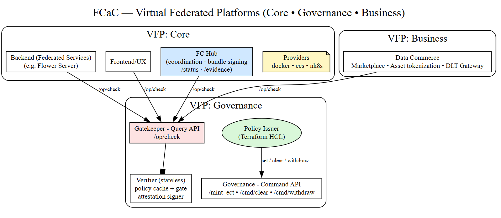


# **Federated Computing as Code (FCaC)**
### _Provisioning trust and sovereignty as executable infrastructure_

---

## **1. Vision**

Modern digital collaboration crosses institutions, borders, and jurisdictions — yet governance remains procedural and fragile.  **Federated Computing as Code (FCaC)** unifies deployment, operation, and authorization into a single declarative paradigm.   Policies, infrastructure, and value exchange are expressed as **contracts** that compile into verifiable, executable artifacts.

Rather than treating governance as an external oversight process, FCaC integrates it directly into the computational substrate as a **cryptographically verifiable property of execution**.   This allows organizations to collaborate securely without central control, exposing only what is authorized while preserving local sovereignty over data and services.

---

## **2. A New Trust Model**

FCaC defines a **cryptographic trust chain** that determines, at every step, _who_ acts, _what_ they can do, and _that_ they legitimately possess that right:

- **KYO (Key Your Organization):** Establishes organizational identity and mutual trust through verifiable certificates. Rather than relying on external registries or centralized certificate authorities, each participant performs a [mutual TLS (mTLS)](https://datatracker.ietf.org/doc/html/rfc8705) handshake to verify organizational control over its private keys and digital credentials 
- **ECT (Envelope Capability Token):** Compiles governance rules into verifiable capabilities that define permitted operations.  The issuer compiles a minimal set of capabilities into signed [JSON Web Tokens (JWT)](https://datatracker.ietf.org/doc/html/rfc7519). Each token becomes a cryptographically sealed excerpt of permissible operations and roles for the holder, expressing _what_ may be done, _under which constraints_, and _on whose authority_ in an operational enclave called the sovereignty envelope.
- **DPoP (Proof of Possession):** Binds actions to the legitimate holder of a private key, preventing theft or replay.  We use  [Demonstration of Proof-of-Possession (DPoP)](https://datatracker.ietf.org/doc/html/rfc9449) to transform authorization into live cryptographic possession, making every permitted operation verifiable and non-transferable — a digital equivalent of presenting one’s personal seal in real time.

> Authorization deterministic and self-contained — no central policy lookup or coordination service is required.  Governance enforcement becomes **stateless and mathematical**, not procedural.

---

## **3. Architecture Overview**

As illustrated in , the architecture defines **Virtual Federated Platforms (VFPs)** built from three declarative **contracts**:

| Contract | Scope | Description |
|-----------|--------|-------------|
| **Core Contract** | Infrastructure | Follows a Terraform-style declarative model but extends it from resource deployment to the provisioning of **virtual federated platforms** — execution environments whose topology, policies, and interfaces are defined as code. |
| **Business Contract** | Value & Incentives | Encodes the operational and economic logic of collaboration — licensing, data sharing, or model exchange. |
| **Governance Contract** | Compliance & Sovereignty | Compiles constitutional rules of engagement into signed, verifiable proofs (capability tokens) that determine what each participant may do. |

> Each VFP is a reproducible, sovereign computing environment:
> **infrastructure, business logic, and governance provisioned together under cryptographic control.**

---

## **4. Stateless Verification**

In conventional systems, policy engines interpret rules dynamically, often inconsistently across services.  In FCaC, governance rules are compiled once — at issuance — into signed artifacts distributed alongside code.  At runtime, only cryptographic verification is needed, allowing verifiers to remain **stateless**, portable, and immune to administrative interference.  

> Every authorized action carries its own verifiable proof of legitimacy

---

## **5. Why It Matters**

FCaC enables organizations to:

- Collaborate securely across data silos and legal boundaries  
- Preserve sovereignty and privacy by design  
- Demonstrate compliance **before** execution, not after  
- Replace manual audits with deterministic cryptographic evidence  

By extending Infrastructure-as-Code into **Governance-as-Code**, FCaC establishes a foundation for distributed systems that are both **autonomous and self-accountable**.

---

## **6. Applications**

FCaC applies wherever autonomy and cooperation must coexist:

- **Healthcare research:** federated model training under regulatory constraints  
- **Sports analytics:** secure cross-team insights without data exposure  
- **Media and digital rights:** declarative licensing and verified attribution  
- **Public-sector ecosystems:** cross-border interoperability under national sovereignty  

> Each domain shares the same invariant: computation occurs only within an envelope of **provable authorization**.

---

## **7. From Infrastructure to Constitutional Computing**

Where DevOps unified code and infrastructure, **FCaC unifies governance and computation.**   It introduces a constitutional contract that defines what each participant may do, compiled into cryptographically verifiable form.   The result is **Sovereignty-as-Code** — governance expressed, versioned, and executed with the same discipline as software.

---

## **8. Status**

- Concept formalized and verified through prototype implementations  
- Stateless verifier and ECT tokens operational in test environments  
- Current work: temporal logic for dynamic delegation and multi-party trust quorums  
- Full model of **Virtual Federated Platform provisioning** to be detailed in forthcoming paper

---

## **9. Attribution and Rights**

This repository is licensed under the **Apache License, Version 2.0**.

**Concept and Design:** Enzo L. Fenoglio (Independent Researcher)  
**Project Goal:** To formalize and demonstrate executable governance for federated infrastructures.  
**Status:** Open conceptual specification; reference implementations in progress.  

> _This repository serves as the canonical timestamped record of the FCaC concept, architecture, and trust model._  
> _All rights reserved. Reproduction or derivative use requires explicit author attribution._

---

**Last Updated:** 2025-11-07  
**License:** © Enzo L. Fenoglio — All Rights Reserved  

A SHA-256 hash of this README is maintained as a cryptographic proof of authorship and version integrity.

